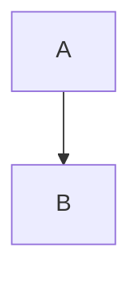

# Repo Best Practices

## Purpose
This repo is a personal digital garden built with Astro.
Current top-level pages are:
- `/` (Home)
- `/about`
- `/delta`
- `/notes`

Keep structure simple, content-first, and static-friendly.

## Dev Commands
- Install deps: `npm install`
- Start local dev: `npm run dev`
- Production build check: `npm run build`

Always run `npm run build` after structural/content renderer changes.

## Content Model
There are two content pipelines right now.

1. `Notes` pipeline (active)
- Source files: `public/notes/*.md`
- Registry: `src/data/notes.ts`
- Index page: `src/pages/notes.astro`
- Note page template: `src/pages/notes/[slug].astro`

2. `Delta` pipeline (Astro content collection)
- Source files: `src/content/delta/*.md`
- Page: `src/pages/delta.astro`

## Creating a New Note (recommended workflow)
1. Create markdown file in `public/notes/`.
Example: `public/notes/decision-latency.md`

2. Add metadata entry in `src/data/notes.ts`.

```ts
export const notes = [
  {
    slug: "decision-latency",
    title: "Decision Latency",
    date: "2026-02-20",
    file: "/notes/decision-latency.md",
  },
  // existing notes...
];
```

3. Use first markdown heading (`# ...`) as the canonical note title.
`src/pages/notes/[slug].astro` will use this H1 and avoid duplicate title rendering.

4. Open `http://localhost:4321/notes` and verify link, date, and note render.

## Creating a New Delta Article
1. Add markdown file to `src/content/delta/`.
Example: `src/content/delta/2026-02-20.md`

2. Frontmatter format:

```md
---
title: "February 20, 2026"
date: 2026-02-20
---

Your delta content...
```

3. Confirm `/delta` shows entry in reverse chronological order.

## Creating New Subpages
Create Astro files under `src/pages`.
- Top-level page: `src/pages/now.astro` -> `/now`
- Nested page: `src/pages/projects/index.astro` -> `/projects`

Subpage best practices:
- Reuse `src/layouts/BaseLayout.astro`
- Keep top navigation intentional; avoid nav bloat
- Prefer static pages unless there is clear dynamic need

## Styling Standards
Global styles live in `src/styles/global.css`.

Rules:
- Use existing CSS variables in `:root` for color and surface changes
- Keep typography consistent with the existing Fraunces + Manrope system
- Put markdown rendering styles under `.markdown ...` selectors only
- Avoid one-off inline styles in pages
- Test mobile (`<=640px`) before merging

If a style only applies to one area, still prefer a named class over element-only selectors.

## Images Best Practices
Store images in `public/images/` with content-based subfolders.
Examples:
- `public/images/notes/`
- `public/images/about/`

Use absolute paths in markdown and Astro:
- ``

Guidelines:
- Use descriptive file names (`signal-detection-loop.png`, not `img1.png`)
- Compress large images before commit
- Always include meaningful alt text

## Mermaid and Visualizations
Current Mermaid runtime is loaded from:
- `public/mermaid-client.js`

Mermaid diagram blocks in markdown:

````md

````

Syntax rules to avoid parse failures:
- Prefer `flowchart TD` over older variants
- For `subgraph` labels with spaces/parentheses, use id + label:
  - `subgraph surface["Surface Layer (Fast, Volatile)"]`
- Keep node IDs simple (`A1`, `B2`, `model_update`)
- If one chart fails, it may block readability of that section even if page loads

When diagrams are editorially stable and must be pixel-consistent, export as SVG/PNG and embed image in markdown.

## Markdown Formatting Rules
To avoid visual regressions:
- Use proper table syntax with header separator row
- Use real list syntax (one item per line with `-`)
- Avoid pseudo-lists inside one sentence
- Keep long wrapped lines readable; prefer paragraph breaks
- Use fenced code blocks for snippets, not indented text unless intentional

## Quality Checklist Before Commit
- `npm run build` succeeds
- New note/article appears in correct index page
- Internal links resolve (no 404s)
- Mermaid blocks render (if added)
- Table/list formatting is visually correct
- Mobile layout remains readable

## Non-Goals
- Do not add heavy CMS/editor infra unless workflow requires it
- Do not introduce client JS frameworks for simple content pages
- Do not increase page count casually; keep information architecture tight
